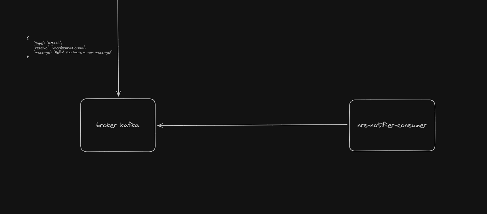

# 📌 nrs-notifier-consumer

O objetivo desse consumidor é consumir os eventos do tópico kafka de notificações. Essas mensagens <strong>precisam</strong>
conter os seguintes dados:
- type: o meio que será enviado a notificação (apenas 'EMAIL' por enquanto)
- receiver: o receptor da mensagem
- message: a mensagem que será enviada

## 🚀 Tecnologias
- Java 21
- Spring framework
- Apache Kafka
- Docker (opcional)

## ⚙️ Como executar

### Pré-requisitos
> 💡 Dica: Recomendo utilizar o [sdkman](https://sdkman.io/) para realizar as insatações do java e maven para centralizar
o versionamento/gerenciamento do java e do maven em um lugar só.

- Java 21
- Maven 3.9.3+
- Kafka 3.4.0 (recomendo utilizar [esse link](https://archive.apache.org/dist/kafka/3.4.0/kafka-3.4.0-src.tgz) de download)

### Executando localmente

- Clone o repositório
  ``` shell
    git clone https://archive.apache.org/dist/kafka/3.4.0/kafka-3.4.0-src.tgz
  ```
<br />

- Vá até a pasta da aplicação
  ```shell
    cd nrs-notifier-api  
  ```

<br />

- Execute o build da aplicação para instalar as dependências necessárias (necessário estar com o maven e suas respectivas
  variáveis configuradas, como a `MAVEN_HOME`)
  ```shell
    mvn clean install  
  ```
<br />

- Execute a aplicação
  ```shell
    mvn spring-boot:run  
  ```

### Iniciando o kafka
```shell
    # iniciar zookeeper
    cd /usr/local/kafka
    sudo bin/zookeeper-server-start.sh config/zookeeper.properties

    # iniciar iniciar o servidor do kafka
    cd /usr/local/kafka
    sudo bin/kafka-server-start.sh config/server.properties

    # create kafka topic
    cd /usr/local/kafka
    sudo bin/kafka-topics.sh --create --topic notifications --bootstrap-server localhost:9092 --partitions 1 --replication-factor 1

    # OPCIONAL - Criar um produtor para enviar as mensagens para serem consumidas
    cd /usr/local/kafka
    sudo bin/kafka-console-producer.sh --topic notifications --bootstrap-server localhost:9092
    
    # ao executar esse comando acima, irá abrir um prompt no terminal para escrever a mensagem, basta adicionar esse json
    # {"type": "EMAIL","receiver": "seuemail@gmail.com","message": "teste message"}
```

### Workflow (ou system design) da aplicação
